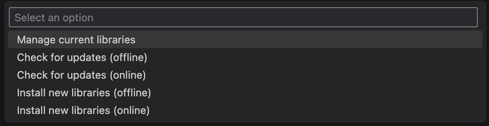

Installation
============

Get up and running with Autopilot in minutes.

Install via vendordep
---------------------

In VS code, press ``Ctrl-Shift-P`` or click the WPILib icon in the top right to
open the command pallete. Search and select ``Manage Vendor Libraries``.

.. image:: install1.png
   :width: 600

Then select ``Install New Libraries (online)``:

Finally, enter the vendordep URL:
``https://therekrab.github.io/autopilot/vendordep.json``.

Run a build to finish up, and you've got Autopilot installed!
It's available with the package name ``com.therekrab.autopilot``.

You *may* have to reopen your editor if suggestions aren't loading right away.

To read about how Autopilot works, checkout :doc:`usage`.
